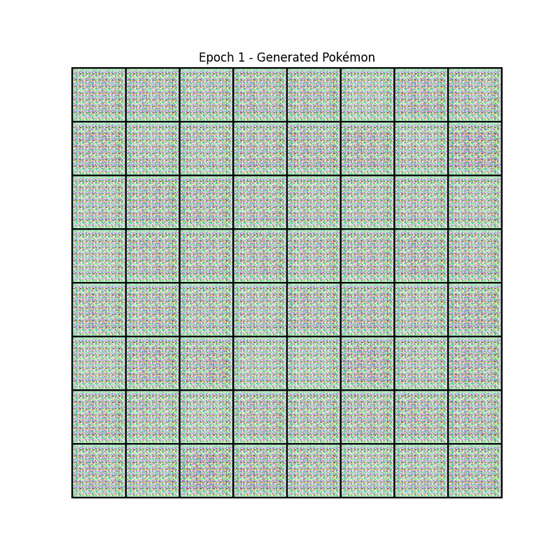

# Pokemon-Generator-GENAI
Generative Adversarial Network trained to generate new Pokémon images using PyTorch and Google Colab.

## Project Highlights
- Uses DCGAN architecture.
- Trained on a curated dataset of Pokémon images
- Tracks training progress across 150 epochs
- Outputs include image samples at each ten epoch and a final GIF visualization

## Tools & Technologies
- Python, PyTorch
- Google Colab
- torchvision, matplotlib, PIL

## Difficulties Encountered
- Limited dataset per class (few images per Pokémon)
- Mode collapse in early training epochs
- Fine-tuning learning rate and batch normalization layers

## Dataset
This project uses a Pokémon image dataset from Kaggle:
🔗 [Pokémon Image Dataset on Kaggle](https://www.kaggle.com/datasets/hlrhegemony/pokemon-image-dataset/data)
*Note: The dataset is used strictly for educational and non-commercial purposes.*

## Final Training GIF  

  

